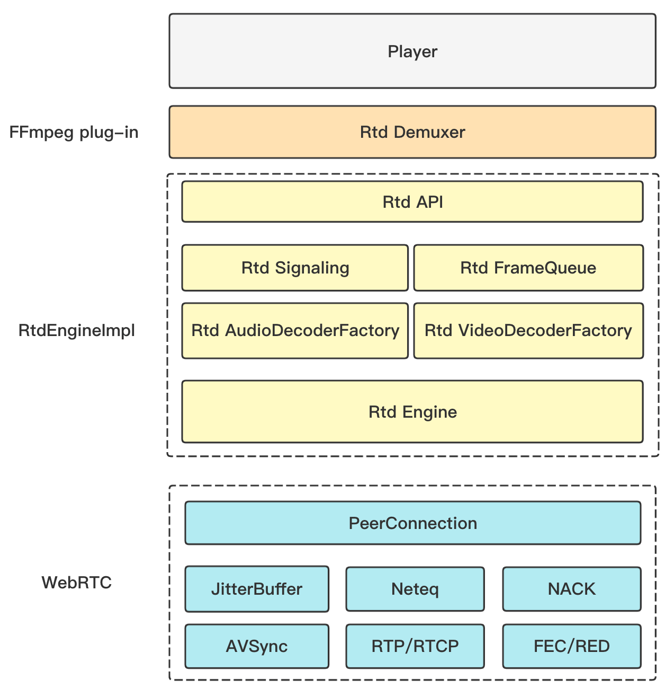

# **Overview of GrowthEase Low Latency** **Player SDK**

A low-latency player SDK is implemented by GrowthEase based on WebRTC. Developers only need to access the SDK and make small changes to the player to have low-latency ability of live streaming.

The SDK provides a set of simple and easy-to-use interfaces, allowing developers to quickly integrate the low-latency live streaming function into existing players by calling the API of the SDK. At the same time, the SDK also encapsulates the API into a kind of FFmpeg plug-in, which is a type of FFmpeg demuxer. Developers only need to compile the SDK and FFmpeg plug-in source code into their own FFmpeg, and do not need to modify the player.By replacing the playback URL, you can directly reuse the original process to have low-latency playback capabilities.

## **Features**

- Low-latency pull streaming, and high anti-weak network performance
- Support OPUS and AAC, of which AAC supports ADTS and LATM, including AAC-LC, AAC-HE, AAC-HEv2
- Support H264
- Video callback H264 bit stream, audio callback PCM data
- Support Windows platform

## **SDK component architecture**

The SDK is mainly divided into three modules:

- FFmpeg plug-in: Rtd Demuxer

- RtdEngineImpl: WebRTC encapsulation layer, including API、engine creation、signaling establishment、media data reception and callback, etc.

- WebRTC: Media establishment、data reception、packet sequencing and framing, etc.

  

## **SDK API call mode**

- FFmpeg plugin integration method

Directly put the src/rtd/ffmpeg/rtd_dec.c file and SDK dynamic library(rtd.dll) into FFmpeg and compile them together. The player does not need to be changed. Low-latency live streaming can be achieved simply by replacing the pull stream URL.

- API integration method

  

## **Overview of Integration Methods**

[Windows Integration](https://github.com/GrowthEase/LLS-Player/blob/main/docs/Windows集成简介.md)

[Introduction in Chinese](https://github.com/GrowthEase/LLS-Player/blob/main/docs/README-CN.md)
