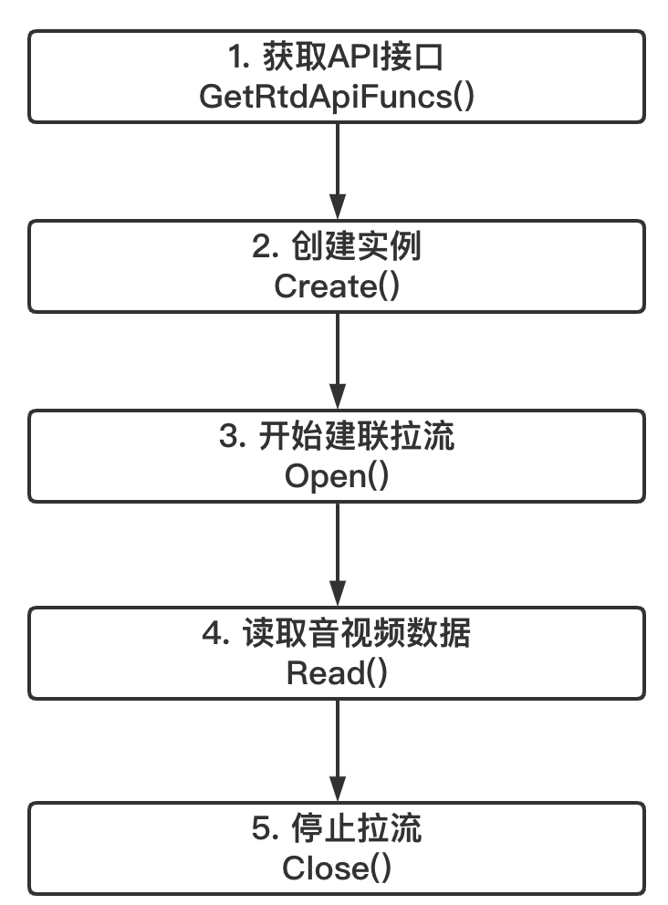

# 网易云信低延时播放器SDK概述

网易云信低延时播放器SDK(以下简称SDK)，是网易云信团队在WebRTC的基础上实现的低延时传输SDK。开发者仅需接入SDK，同时对播放器进行少量的改动，即可拥有低延时直播的能力。

SDK提供了一套简单易用的接口，允许开发者通过调用SDK的API，快速集成低延时直播功能到现有的播放器中。同时SDK还将API封装成了FFmpeg插件，作为FFmpeg AVInputFormat的一种，对于使用FFmpeg作为基础库的播放器，开发者仅需将SDK和FFmpeg插件源码编译到自己的FFmpeg中，不需要对播放器进行改造，通过替换播放URL，直接复用原有的流程就可以拥有低延时播放的能力。

## 功能特性

- 低延时拉流，同时具有高抗弱网性能
- 支持OPUS和AAC，其中AAC支持ADTS，LATM，包括AAC-LC、AAC-HE、AAC-HEv2
- 支持H264
- 视频回调H264码流，音频回调PCM数据
- 支持Windows平台

## SDK组件架构

SDK主要分为3个模块：

- **FFmpeg plug-in:** FFmpeg插件
- **RtdEngineImpl:** WebRTC封装层，包含API、引擎创建、信令建联、媒体数据的接收回调等
- **WebRTC:** 媒体建联，数据接收，数据包排序组帧等

## SDK接口调用

- **FFmpeg插件集成方式**

  直接将src/rtd/ffmpeg/rtd_dec.c文件和SDK动态库文件放到FFmpeg中一起编译，播放器无需改动，只需替换拉流URL就可以实现低延时直播

- **API集成方式**

  

## 集成方法概述

[Windows集成方式](https://github.com/GrowthEase/LLS-Player/blob/main/docs/Windows集成简介.md)