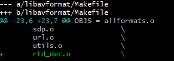
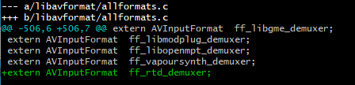

## 搭建编译环境
### 安装 vs2019。

微软官方下载地址： https://visualstudio.microsoft.com/zh-hans/vs/。

根据需要安装专业版或社区版。安装时需要安装sdk 10.0.19041。

必要步骤：在添加删除程序中，对sdk 10.0.19041，修改——change——**勾选 debug tools for windows**。


**后面以VS2019 社区版为例，安装在C:\Program Files (x86)\Microsoft Visual Studio\2019\Community进行说明。**

添加环境变量（通过右键我的电脑——高级系统设置——高级——环境变量）

```
set vs2019_install=C:\Program Files (x86)\Microsoft Visual Studio\2019\Community
```

### 安装deptools

谷歌官方下载地址： https://storage.googleapis.com/chrome-infra/depot_tools.zip

**depot_tools** 解压后，添加到环境变量path中

添加环境变量

```
set DEPOT_TOOLS_WIN_TOOLCHAIN=0
```

### 安装git

官方下载地址  https://github.com/git-for-windows/git/releases/download/v2.33.1.windows.1/Git-2.33.1-64-bit.exe


## 下载源码

本项目基于WebRTC M94版本进行开发，需要先下载WebRTC原生代码，然后下载云信的低延时直播代码LLS-Player，最后将LLS-Player代码覆盖到WebRTC原生代码中。

### 下载WebRTC M94源码

WebRTC对应的代码分支和commitId如下，跟进下面的步骤操作即可下载对应的源码。

```shell
mkdir webrtc
cd webrtc
fetch --nohooks webrtc                             // 拉取WebRTC代码
cd src
git checkout -b m94 branch-heads/4606              // 此处基于4606创建m94分支。
git reset --hard  b83487f08ff836437715b488f73416215e5570dd      // 重置到我们使用的版本。
gclient sync 
```

### 下载LLS-Player源码

```shell
git clone https://github.com/GrowthEase/LLS-Player.git
```

**代码下载后，将LLS-Player/src目录下所有文件覆盖到上面下载的WebRTC M94版本中**


## 代码编译

Windows下，打开git，切换到src目录，执行如下命令：

```
./build_win.sh x86 --enable-shared
```
编译完成后，在src/out/win32/Release目录下会生成动态库rtd.dll和对应的rtd.dll.lib。

接下来将FFmpeg插件和FFmpeg一起编译，生成支持低延时拉流的FFmpeg库文件

### SDK和FFmpeg一起编译

以FFmpeg release/4.3版本为例。

* 将src/rtd/ffmpeg/rtd_dec.c文件拷贝到FFmpeg/libavformat文件夹下

* 修改FFmpeg/libavformat中的MakeFile文件，添加rtd_dec.o编译

  

* 修改FFmpeg/libavformat/allformats.c文件

  

* 添加FFmpeg configure时SDK头文件和库文件的依赖

  ```
  ./configure --enable-shared --arch=i386 --target-os=mingw32 --prefix="xxx/xxx" --extra-cflags=-I/xxx/rtd/include --extra-ldflags=-L/xxx/rtd/libs --extra-libs=-lrtd --enable--nonfree
  ```

  --prefix="xxx/xxx" ：编译完成后生成库文件的路径

  --extra-cflags=-I/xxx/rtd/include：LLS-Player头文件路径

  --extra-ldflags=-L/xxx/rtd/libs：LLS-Player编译生成的动态库路径

  上述路径根据实际情况指定

* 编译

  ```
  make && make install
  ```

将编译好的FFmpeg库文件和对应的rtd.dll文件一起放到播放器中，播放器就具备了低延时直播的能力。使用nertc://开头的拉流地址，播放器不需要做任何修改，就可以使用低延时拉流的能力

  

  


