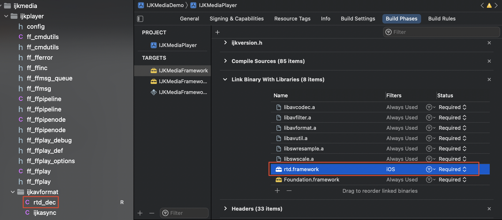

## 搭建编译环境

### 安装deptools

谷歌官方下载地址： https://storage.googleapis.com/chrome-infra/depot_tools.zip

**depot_tools** 解压后，进入目录，打开cmd，执行如下命令来安装一些基础库

```
gclient
```

安装完成后将路径添加到环境变量path中

## 下载源码

本项目基于WebRTC M94版本进行开发，需要先下载WebRTC原生代码，然后下载云信的低延时直播代码LLS-Player，最后将LLS-Player代码覆盖到WebRTC原生代码中。

### 下载WebRTC M94源码

WebRTC对应的代码分支和commitId如下，跟进下面的步骤操作即可下载对应的源码。

```shell
mkdir webrtc
cd webrtc
fetch --nohooks webrtc_ios                     // 拉取WebRTC代码
cd src
git checkout -b m94 branch-heads/4606              // 此处基于4606创建m94分支。
git reset --hard  b83487f08ff836437715b488f73416215e5570dd      // 重置到我们使用的版本。
gclient sync 
```

### 下载LLS-Player源码

```shell
git clone https://github.com/GrowthEase/LLS-Player.git
```

**代码下载后，将LLS-Player/src目录下所有文件覆盖到上面下载的WebRTC M94版本中**

## 代码编译

Mac打开Shell，切换到src目录，执行如下命令：

```
./build_ios.sh --allarch copy
```

编译完成后，在src/rtd/project/ios/out/目录下会生成动态库rtd.framework和静态库librtd.a

## SDK集成

将SDK中的头文件和库文件和rtd_dec.c文件集成到播放器工程中，以**ijkplayer**为例

### 导入动态库和头文件

将动态库拷贝到指定的库目录下，（具体目录根据实际情况指定），如下图所示：

（1）将rtd.framework或者librtd.a放入ijkplayer/ios/build/universal/lib目录下

（2）头文件nertd_api.h和rtd_def.h放入ijkplayer/ios/build/universal/include目录下 

### 添加FFMPEG插件代码和库文件

将rtd_dec.c文件拷贝到工程的源码目录下参与编译，（具体位置可以自己指定），例如ijkplayer中放到ijkavformat目录下。以rtd.framework为例



### SDK接入修改

以ijkplayer为例，在ff_ffplay.c中添加低延时拉流的逻辑

**（1）包含头文件和必要的变量声明**

```c++
#include "rtd_api.h" // 设置好头文件路径即可

extern AVInputFormat ff_rtd_demuxer;
```

**（2）注册低延时拉流协议**

 在read_thread()函数里，从url中区分出低延时拉流协议头，例如（"nertc"），设置AVInputFormat为ff_rtd_demuxer。

**以上都需要在avformat_open_input()之前设置，avformat_open_input()最后一个参数需要设置options**

```c
if (strncmp(is->filename, "nertc://", 8) == 0) { // 协议头根据实际情况进行设置，这里以"nertc"为例
    // 设置AVInputFormat 为ff_nertc_demuxer
	is->iformat = &ff_rtd_demuxer;
}

// 上述代码在avformat_open_input前
err = avformat_open_input(&ic, is->filename, is->iformat, &ffp->format_opts);
```

### 重新编译播放器

上述设置完成后需要重新编译播放器工程，例如ijkplayer，打开ijkplayer/ios/ijkMediaDemo工程，直接运行编译即可。

### 拉流播放

输入对应的拉流URL进行播放，等待avformat_open_input()函数返回，返回成功则表示建连成功。

后续按照播放器的流程进行音视频帧的读取，解码，渲染即可正常播放。